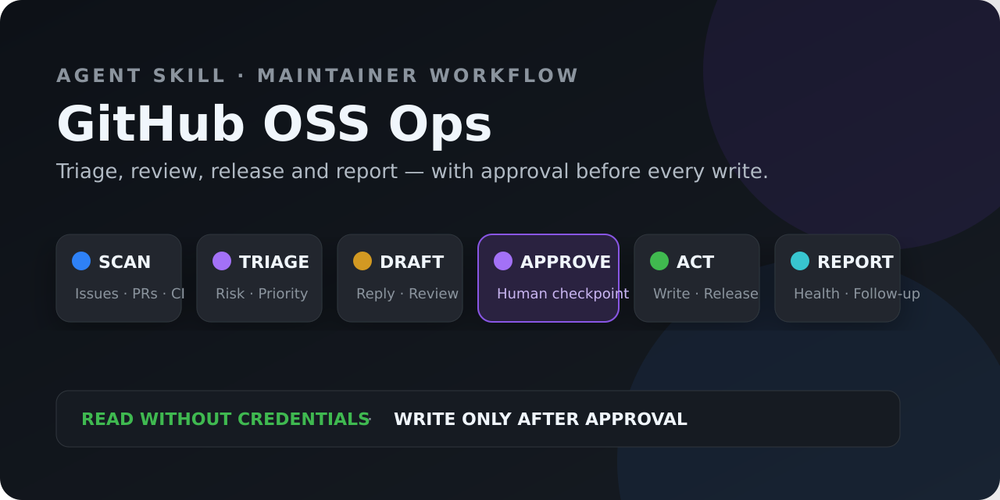

# GitHub OSS Ops

[中文](#中文) · [English](#english)

[](https://github.com/hyt315/github-oss-ops/actions/workflows/validate.yml)
[](https://github.com/hyt315/github-oss-ops/releases/latest)
[](https://github.com/hyt315/github-oss-ops/releases)
[](CONTRIBUTORS.md)
[](LICENSE)

给独立维护者和小团队使用的 GitHub 运营 Agent Skill：扫描 Issue/PR、生成可审查草稿、辅助版本发布，并把所有外部写操作留在明确批准之后。

```bash
git clone https://github.com/hyt315/github-oss-ops.git ~/.agents/skills/github-oss-ops
```

[安装为 Agent Skill](#安装为-agent-skill) · [查看三个真实工作流](examples/README.md) · [下载最新版](https://github.com/hyt315/github-oss-ops/releases/latest)



## 中文

### 它解决什么问题

项目发布只是开始。维护者还要反复查看 Issue、确认重复问题、审查 PR、跟踪 CI、整理版本说明和处理长期无响应内容。GitHub OSS Ops 把这些步骤组织成可复核的工作流，同时保留人的最终决定权。

| 工作流 | Skill 会做什么 | 默认边界 |
| --- | --- | --- |
| Issue 分流 | 聚合新 Issue、判断类型/优先级/重复项、起草回复 | 读取可直接进行；评论、标签和关闭需批准 |
| PR 辅助审查 | 汇总 diff、CI、风险、测试和发布影响 | 不伪装成人工审查，不在未批准时提交 Review |
| Release 管理 | 根据已合并改动建议 SemVer、生成说明、核对版本一致性 | Tag、Release 和推送分别确认 |
| Stale 管理 | 识别长期无响应内容并提出分批处理建议 | 不自动批量关闭 |
| 运营报告 | 输出响应时间、积压、合并和版本节奏 | 区分事实、推断与建议 |

### 三个可复核示例

仓库包含三个完整示例，展示输入、只读分析、批准点与预期输出：

1. [新 Issue 分流与重复检测](examples/README.md#示例一新-issue-分流)
2. [PR 风险审查与 CI 诊断](examples/README.md#示例二pr-风险审查)
3. [周报与 Release 草稿](examples/README.md#示例三周报与-release-草稿)

### 安装为 Agent Skill

必须保留完整仓库结构；`SKILL.md` 会引用 `references/`。

| 平台 | 用户级安装 | 调用方式 |
| --- | --- | --- |
| ChatGPT（Codex 模式）/ Codex CLI | `git clone https://github.com/hyt315/github-oss-ops.git ~/.agents/skills/github-oss-ops` | 提示词中使用 `$github-oss-ops`，或通过 `/skills` 选择 |
| Claude Code | `git clone https://github.com/hyt315/github-oss-ops.git ~/.claude/skills/github-oss-ops` | 要求 Claude 使用 `github-oss-ops` skill |
| Cursor | `git clone https://github.com/hyt315/github-oss-ops.git ~/.cursor/skills/github-oss-ops` | 要求 Cursor Agent 使用 `github-oss-ops` skill |

项目级安装可分别使用 `.agents/skills/github-oss-ops`、`.claude/skills/github-oss-ops` 或 `.cursor/skills/github-oss-ops`。新安装没有被发现时，重启对应 Agent。

Windows PowerShell：

```powershell
git clone https://github.com/hyt315/github-oss-ops.git "$HOME\.agents\skills\github-oss-ops"
```

### 下载

```bash
# HTTPS
git clone https://github.com/hyt315/github-oss-ops.git

# SSH
git clone git@github.com:hyt315/github-oss-ops.git

# GitHub CLI
gh repo clone hyt315/github-oss-ops

# main 分支 ZIP
curl -L https://github.com/hyt315/github-oss-ops/archive/refs/heads/main.zip -o github-oss-ops-main.zip

# 只查看技能合同（单文件不是完整安装）
curl -L https://raw.githubusercontent.com/hyt315/github-oss-ops/main/SKILL.md -o SKILL.md
```

浏览器入口：[最新 Release](https://github.com/hyt315/github-oss-ops/releases/latest) · [main ZIP](https://github.com/hyt315/github-oss-ops/archive/refs/heads/main.zip)

### 五分钟开始

安装后可以直接说：

```text
使用 $github-oss-ops 扫描 hyt315/notebook-video 最近 7 天的 Issue、PR 和 CI。
先做只读分析，给出需要关注的项目和回复草稿；未经我确认不要评论、打标签、关闭、合并或发布。
```

公开仓库的只读分析不需要 Token。需要写入 GitHub 时，优先使用平台官方 GitHub 连接、GitHub 官方 MCP 的 OAuth，或已登录的 `gh`；再考虑最小权限、限定仓库、设置有效期的 fine-grained PAT。

Skill 不会要求你把 Token 发到聊天中，不会扫描用户主目录寻找凭据，也不会打印或写入 Token。完整认证与故障排查见 [references/github-access-guide.md](references/github-access-guide.md)。

### 安全模型

- 只读扫描、分类和草稿生成可以直接执行。
- 评论、标签、指派、关闭、合并、推送、规则修改和 Release 都是外部写操作，必须在目标与内容明确后获得批准。
- 安全漏洞只进入 GitHub Private Vulnerability Reporting 等私密渠道。
- 批量操作先小批预览，并设置上限；不自动关闭、不自动合并。
- 所有统计报告标注时间窗口，不把缺失数据写成事实。

### 仓库结构与验证

- `SKILL.md`：主工作流与批准边界。
- `references/`：分流、回复、PR、Release、认证和自动化参考。
- `examples/`：三个端到端输出示例。
- `scripts/validate-skill.mjs`：结构、链接、版本和隐私静态检查。
- `.github/workflows/validate.yml`：PR 与主分支 CI。

```bash
node scripts/validate-skill.mjs
```

### 许可证与贡献

项目使用 [MIT License](LICENSE)。参与前请阅读 [CONTRIBUTING.md](CONTRIBUTING.md)、[CODE_OF_CONDUCT.md](CODE_OF_CONDUCT.md)、[SECURITY.md](SECURITY.md) 和 [CONTRIBUTORS.md](CONTRIBUTORS.md)。

## English

GitHub OSS Ops is an approval-gated Agent Skill for maintainers who need repeatable Issue triage, PR review assistance, release preparation, stale-item review and repository health reporting.

### Key behavior

- Public read-only analysis works without credentials.
- The skill drafts before it comments, labels, closes, merges, pushes or releases.
- Authentication prefers an official GitHub connection or OAuth, then an authenticated GitHub CLI, then a repository-scoped fine-grained PAT.
- It never searches a home directory for credentials, prints tokens or asks users to paste secrets into chat.
- Three inspectable workflows live in [examples/README.md](examples/README.md).

### Install

```bash
# Codex / ChatGPT Codex mode
git clone https://github.com/hyt315/github-oss-ops.git ~/.agents/skills/github-oss-ops

# Claude Code
git clone https://github.com/hyt315/github-oss-ops.git ~/.claude/skills/github-oss-ops

# Cursor
git clone https://github.com/hyt315/github-oss-ops.git ~/.cursor/skills/github-oss-ops
```

Validate with `node scripts/validate-skill.mjs`. See the Chinese section above for download methods, operating boundaries and the repository map.

### Sources

The authentication and tool guidance follows the [official GitHub MCP Server](https://github.com/github/github-mcp-server) and GitHub's documentation for [fine-grained personal access tokens](https://docs.github.com/authentication/keeping-your-account-and-data-secure/managing-your-personal-access-tokens), [repository topics](https://docs.github.com/repositories/managing-your-repositorys-settings-and-features/customizing-your-repository/classifying-your-repository-with-topics) and [private vulnerability reporting](https://docs.github.com/code-security/security-advisories/working-with-repository-security-advisories/configuring-private-vulnerability-reporting-for-a-repository).
